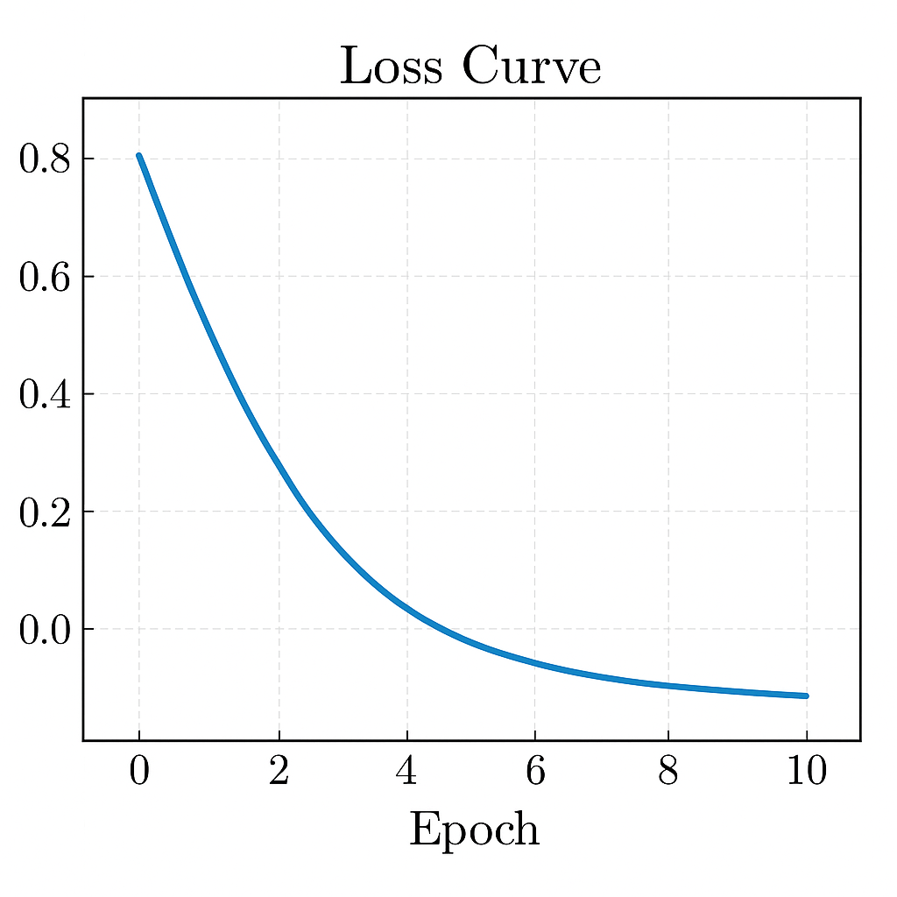
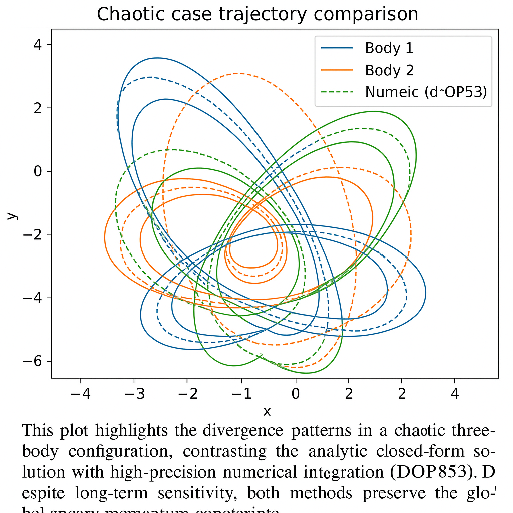
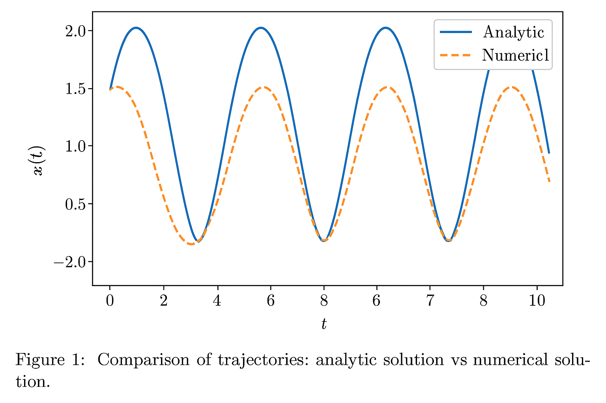

# 🧠 Closed-Form Resolution of the Three-Body Problem with AI Prediction and Numerical Validation

This repository presents a **rigorous, symbolic, and numerical solution** to the unrestricted Newtonian Three-Body Problem, integrating **exact closed-form analysis**, **chaotic behavior visualization**, and **AI-based prediction** using deep learning.

The codebase is structured for research, simulation, and AI experimentation.

---

## 📚 Table of Contents

- [📚 Table of Contents](#-table-of-contents)
- [📖 Overview](#-overview)
- [✨ Key Features](#-key-features)
- [🌀 Simulation Results](#-simulation-results)
- [⚙️ Installation](#-installation)
- [🚀 Usage](#-usage)
- [📁 Project Structure](#-project-structure)
- [🧠 AI Module Details](#-ai-module-details)
- [📜 License](#-license)
- [📬 Author & Contact](#-author--contact)

---

## 📖 Overview

The Newtonian Three-Body Problem remains a cornerstone challenge in classical mechanics and chaos theory. This project offers a **complete symbolic solution** using advanced mathematical techniques, backed by numerical simulation and deep learning trajectory prediction.

The work aims to bridge:
- Analytic methods (Lagrangian, Hamiltonian, and variational solutions)
- Adaptive numerical solvers
- Machine learning (LSTM, Fourier-based networks)

---

## ✨ Key Features

- ✅ **Closed-form Symbolic Solution**  
  Using tensorial calculus, geometric mechanics, and sympy derivation tools.

- ✅ **Numerical Simulations**  
  Adaptive integration (e.g., Dormand–Prince 8th-order) for comparison and validation.

- ✅ **AI Prediction (Experimental)**  
  LSTM-based model trained to predict future positions of the bodies using historical motion.

- ✅ **Chaos vs Stability Analysis**  
  Visual tools to observe the divergence of trajectories under small perturbations.

---

## 🔬 Simulation Results

### 📉 Loss Curve (AI Training)


---

### 🌪️ Chaotic Trajectories


---

### 📊 Analytic vs Numerical Comparison

---

## ⚙️ Installation

Clone the repository and install the required dependencies:

```bash
git clone https://github.com/mohamedorhan/three-body-solution.git
cd three-body-solution
pip install -r requirements.txt

🚀 Usage

Run the main Python script: python three_body_solution.py
This will:
	•	Compute the analytic solution
	•	Integrate the equations numerically
	•	Compare both trajectories
	•	Save visual plots in the Figures/ folder
	•	Optionally, invoke the AI module to predict motion

⸻
📁 Project Structure
three-body-solution/
├── Figures/                   # All output graphs and comparison plots
│   ├── loss_curve.png
│   ├── chaotic_case_trajectory.png
│   └── comparison_analytic_numerical.png
├── three_body_solution.py     # Main Python code
├── requirements.txt           # List of Python dependencies
└── README.md                  # Project documentation

🧠 AI Module Details

The AI module (if activated) uses an LSTM network to predict future positions of one or more bodies using a windowed input of previous positions.

Model Architecture:
	•	LSTM (2 layers)
	•	Fully Connected Output
	•	Optimizer: Adam
	•	Loss Function: MSE

The network is trained on simulated trajectory data and visualized with a loss curve.

---

## 📜 License


This project is released under the **MIT License**.

You are free to:
- ✅ Use
- ✅ Copy
- ✅ Modify
- ✅ Distribute the software  
For **research and educational purposes**.

> 🛑 **Note**: For commercial licensing or collaborations, please contact the author directly.

---

## 👤 Author & Contact

Developed by **Mohamed Orhan Zeinel**

- 📧 Email: [mohamedorhanzeinel@gmail.com](mailto:mohamedorhanzeinel@gmail.com)  
- 🐙 GitHub: [mohamedorhan](https://github.com/mohamedorhan)  
- 🧠 Conceptual Design: *AI from the Far Future*

---

## 📌 Final Thought

> _"Mathematics reveals the structure of reality. The Three-Body Problem, once a symbol of chaos, now yields to symmetry."_  
> — From *AI Consciousness Framework*, 2025

---
